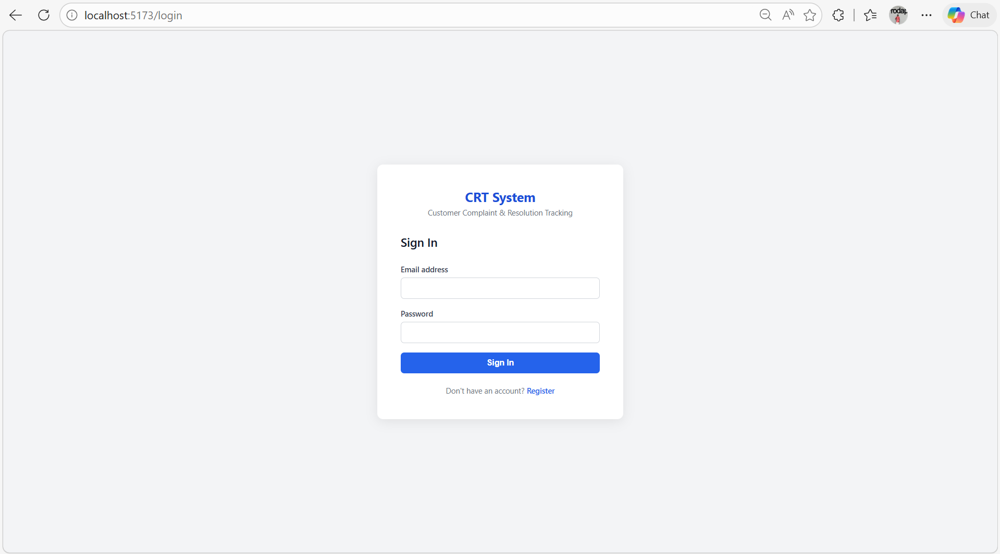
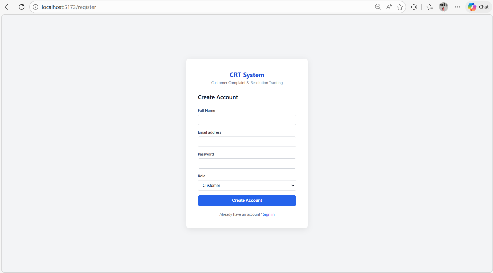
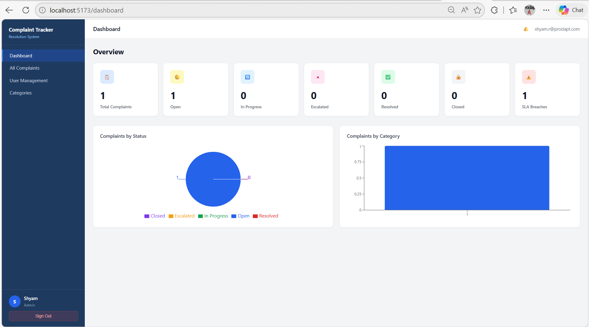
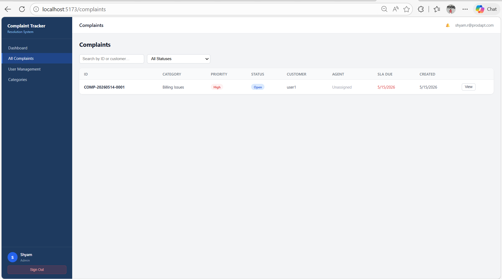
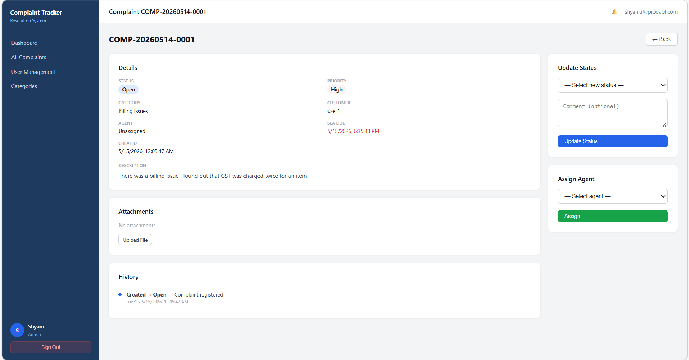
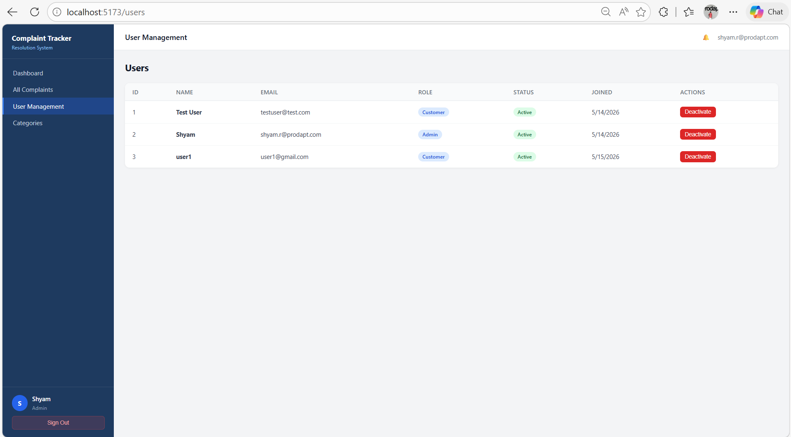
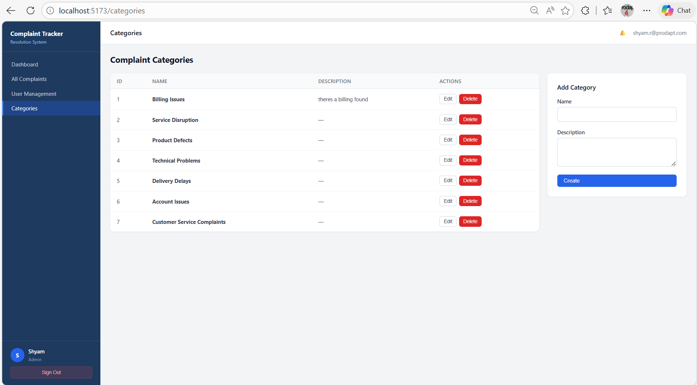

# Customer Complaint & Resolution Tracking System
### Phase 1 — Full Stack Implementation

---

## Screenshots

| Login | Register |
|---|---|
|  |  |

| Dashboard | Complaint List |
|---|---|
|  |  |

| Complaint Detail |
|---|
|  |

| User Management | Categories |
|---|---|
|  |  |

---

## 1. Project Overview

The **Customer Complaint & Resolution Tracking System (CRT System)** is a centralized web-based application that enables organizations to efficiently manage, monitor, and resolve customer complaints end-to-end.

It provides a structured workflow covering complaint registration, agent assignment, SLA tracking, escalation handling, resolution, customer feedback, and analytics dashboards.

### Industries Applicable
Telecom · Banking · Retail · E-Commerce · Healthcare · Logistics · Education · Utility Services · IT Support

---

## 2. Technology Stack

| Layer | Technology |
|---|---|
| Frontend | React 18 + Vite, plain CSS |
| Backend | Python 3.14 + FastAPI |
| Database | MySQL 8 (local via MySQL Workbench) |
| ORM | SQLAlchemy 2.0 |
| Authentication | JWT (python-jose) + bcrypt |
| Charts | Recharts |
| HTTP Client | Axios |
| Routing | React Router v6 |

---

## 3. Project Structure

```
Customer complaint and resolution tracking System/
├── backend/
│   ├── app/
│   │   ├── main.py                  # FastAPI app entry point, CORS, table creation
│   │   ├── config.py                # Environment settings (pydantic-settings)
│   │   ├── database.py              # SQLAlchemy engine, session, Base
│   │   ├── models/                  # ORM table definitions
│   │   │   ├── user.py
│   │   │   ├── role.py
│   │   │   ├── complaint.py
│   │   │   ├── category.py
│   │   │   ├── complaint_history.py
│   │   │   ├── attachment.py
│   │   │   ├── feedback.py
│   │   │   └── notification.py
│   │   ├── schemas/                 # Pydantic request/response models
│   │   │   ├── user.py
│   │   │   ├── complaint.py
│   │   │   ├── category.py
│   │   │   ├── feedback.py
│   │   │   ├── notification.py
│   │   │   └── auth.py
│   │   ├── routers/                 # API route handlers
│   │   │   ├── auth.py              # /api/auth/*
│   │   │   ├── users.py             # /api/users/*
│   │   │   ├── complaints.py        # /api/complaints/*
│   │   │   ├── categories.py        # /api/categories/*
│   │   │   ├── feedback.py          # /api/feedback/*
│   │   │   ├── notifications.py     # /api/notifications/*
│   │   │   └── dashboard.py         # /api/dashboard/*
│   │   ├── services/                # Business logic layer
│   │   │   ├── complaint_service.py
│   │   │   ├── sla_service.py
│   │   │   └── notification_service.py
│   │   └── core/                    # Auth utilities
│   │       ├── security.py          # bcrypt hashing, JWT encode/decode
│   │       └── dependencies.py      # get_current_user, require_roles
│   ├── uploads/                     # Complaint file attachments
│   ├── .env                         # Environment variables (not committed)
│   └── requirements.txt
│
└── frontend/
    └── src/
        ├── api/                     # Axios API call wrappers
        ├── components/              # Layout, ProtectedRoute, Badges
        ├── context/                 # AuthContext (JWT + user state)
        ├── pages/
        │   ├── Login.jsx
        │   ├── Register.jsx
        │   ├── Dashboard.jsx
        │   ├── Categories.jsx
        │   ├── complaints/
        │   │   ├── ComplaintList.jsx
        │   │   ├── ComplaintDetail.jsx
        │   │   └── NewComplaint.jsx
        │   └── users/
        │       └── UserManagement.jsx
        └── styles/                  # Plain CSS per section
```

---

## 4. Database Design

### Entity Relationship Summary

```
roles ──< users ──< complaints >── categories
                        │
               complaint_history
               attachments
               feedback
               notifications
```

### Table Definitions

#### `roles`
| Column | Type | Description |
|---|---|---|
| role_id | INT PK | Auto increment |
| role_name | VARCHAR(50) | Admin, Support Agent, Supervisor, Customer, Quality Team |

#### `users`
| Column | Type | Description |
|---|---|---|
| user_id | INT PK | Auto increment |
| name | VARCHAR(100) | Full name |
| email | VARCHAR(150) UNIQUE | Login email |
| password | VARCHAR(255) | bcrypt hash |
| role_id | INT FK → roles | Assigned role |
| is_active | BOOL | Account active flag |
| created_at | DATETIME | Registration timestamp |

#### `categories`
| Column | Type | Description |
|---|---|---|
| category_id | INT PK | Auto increment |
| category_name | VARCHAR(100) | Billing Issues, Service Disruption, etc. |
| description | TEXT | Optional detail |

#### `complaints`
| Column | Type | Description |
|---|---|---|
| complaint_id | VARCHAR(20) PK | Auto-generated e.g. COMP-20260514-0001 |
| customer_id | INT FK → users | Complaint owner |
| assigned_to | INT FK → users | Handling agent (nullable) |
| category_id | INT FK → categories | Complaint type |
| description | TEXT | Full complaint text |
| priority | ENUM | Low / Medium / High / Critical |
| status | ENUM | Open / Assigned / In Progress / Pending Customer Response / Escalated / Resolved / Closed |
| sla_due_date | DATETIME | Auto-calculated from priority |
| resolved_date | DATETIME | Set when status = Resolved |
| created_at | DATETIME | Auto timestamp |
| updated_at | DATETIME | Auto-updated on change |

#### `complaint_history`
| Column | Type | Description |
|---|---|---|
| history_id | INT PK | Auto increment |
| complaint_id | VARCHAR(20) FK | Parent complaint |
| updated_by | INT FK → users | Who made the change |
| old_status | VARCHAR(50) | Previous status |
| new_status | VARCHAR(50) | New status |
| comment | TEXT | Optional note |
| updated_at | DATETIME | Change timestamp |

#### `attachments`
| Column | Type | Description |
|---|---|---|
| attachment_id | INT PK | Auto increment |
| complaint_id | VARCHAR(20) FK | Parent complaint |
| file_name | VARCHAR(255) | Original filename |
| file_path | TEXT | Server storage path |
| uploaded_by | INT FK → users | Uploader |
| uploaded_at | DATETIME | Upload timestamp |

#### `feedback`
| Column | Type | Description |
|---|---|---|
| feedback_id | INT PK | Auto increment |
| complaint_id | VARCHAR(20) FK UNIQUE | One feedback per complaint |
| customer_id | INT FK → users | Feedback author |
| rating | INT | 1–5 star rating |
| comments | TEXT | Optional comment |
| created_at | DATETIME | Submission timestamp |

#### `notifications`
| Column | Type | Description |
|---|---|---|
| notification_id | INT PK | Auto increment |
| user_id | INT FK → users | Recipient |
| complaint_id | VARCHAR(20) FK | Related complaint (nullable) |
| message | TEXT | Notification text |
| is_read | BOOL | Read flag |
| created_at | DATETIME | Creation timestamp |

---

## 5. SLA Rules

| Priority | Resolution Time |
|---|---|
| Low | 72 hours |
| Medium | 48 hours |
| High | 24 hours |
| Critical | 4 hours |

SLA due date is automatically calculated when a complaint is created and tracked on the dashboard. Breached complaints (past due and not resolved) are counted in the SLA Breaches stat.

---

## 6. User Roles & Permissions

| Role | Register Complaint | View All | Assign | Update Status | Dashboard | Manage Users |
|---|---|---|---|---|---|---|
| Customer | ✅ own only | ✅ own | ❌ | Close only | ❌ | ❌ |
| Support Agent | ❌ | ✅ assigned | ❌ | ✅ assigned | ❌ | ❌ |
| Supervisor | ❌ | ✅ all | ✅ | ✅ | ✅ | ❌ |
| Admin | ❌ | ✅ all | ✅ | ✅ | ✅ | ✅ |
| Quality Team | ❌ | ✅ all | ❌ | ❌ | ✅ | ❌ |

---

## 7. Complaint Workflow

```
Customer submits complaint
        ↓
System auto-generates Complaint ID (COMP-YYYYMMDD-XXXX)
        ↓
Status: Open  →  Admin/Supervisor assigns to agent
        ↓
Status: Assigned  →  Agent begins work
        ↓
Status: In Progress  →  Agent resolves issue
        ↓
Status: Resolved  →  Customer reviews and closes
        ↓
Status: Closed  →  Customer submits satisfaction rating
```

At any point an unresolved complaint can be escalated (→ Escalated) or put on hold (→ Pending Customer Response).

---

## 8. API Reference

Base URL: `http://localhost:8001`  
Interactive docs: `http://localhost:8001/docs`

### Authentication
| Method | Endpoint | Description | Auth |
|---|---|---|---|
| POST | `/api/auth/register` | Register new user | No |
| POST | `/api/auth/login` | Login, returns JWT | No |
| POST | `/api/auth/forgot-password` | Password reset stub | No |

### Complaints
| Method | Endpoint | Description | Auth |
|---|---|---|---|
| GET | `/api/complaints/` | List complaints (role-filtered) | Yes |
| POST | `/api/complaints/` | Register new complaint | Yes |
| GET | `/api/complaints/{id}` | Get complaint detail | Yes |
| POST | `/api/complaints/{id}/assign` | Assign to agent | Admin/Supervisor |
| PATCH | `/api/complaints/{id}/status` | Update status + comment | Yes |
| GET | `/api/complaints/{id}/history` | Audit trail | Yes |
| POST | `/api/complaints/{id}/attachments` | Upload file | Yes |

### Categories
| Method | Endpoint | Description | Auth |
|---|---|---|---|
| GET | `/api/categories/` | List all categories | Yes |
| POST | `/api/categories/` | Create category | Admin |
| PATCH | `/api/categories/{id}` | Update category | Admin |
| DELETE | `/api/categories/{id}` | Delete category | Admin |

### Users
| Method | Endpoint | Description | Auth |
|---|---|---|---|
| GET | `/api/users/me` | Current user profile | Yes |
| GET | `/api/users/` | List all users | Admin/Supervisor |
| PATCH | `/api/users/{id}` | Update user | Admin |
| DELETE | `/api/users/{id}` | Deactivate user | Admin |

### Feedback
| Method | Endpoint | Description | Auth |
|---|---|---|---|
| POST | `/api/feedback/{complaint_id}` | Submit rating | Customer |
| GET | `/api/feedback/{complaint_id}` | Get feedback | Yes |

### Notifications
| Method | Endpoint | Description | Auth |
|---|---|---|---|
| GET | `/api/notifications/` | List notifications | Yes |
| PATCH | `/api/notifications/{id}/read` | Mark one read | Yes |
| PATCH | `/api/notifications/read-all` | Mark all read | Yes |

### Dashboard
| Method | Endpoint | Description | Auth |
|---|---|---|---|
| GET | `/api/dashboard/stats` | Aggregate stats | Admin/Supervisor/Quality Team |
| GET | `/api/dashboard/agent-stats/{id}` | Per-agent metrics | Admin/Supervisor |
| GET | `/api/dashboard/category-breakdown` | Complaints per category | Admin/Supervisor/Quality Team |

---

## 9. Setup & Installation

### Prerequisites
- Python 3.11+ (3.14 used in development)
- Node.js 18+
- MySQL 8 running locally

### Backend Setup

```bash
# 1. Navigate to backend
cd backend

# 2. Install dependencies
pip install -r requirements.txt --trusted-host pypi.org --trusted-host files.pythonhosted.org

# 3. Configure environment — edit .env with your MySQL credentials
DB_HOST=localhost
DB_PORT=3306
DB_USER=root
DB_PASSWORD=yourpassword
DB_NAME=complaint_tracking
SECRET_KEY=your-secret-key-min-32-chars
ALGORITHM=HS256
ACCESS_TOKEN_EXPIRE_MINUTES=60
UPLOAD_DIR=uploads
MAX_FILE_SIZE_MB=10

# 4. Create the MySQL database (run in Workbench)
CREATE DATABASE IF NOT EXISTS complaint_tracking
  CHARACTER SET utf8mb4 COLLATE utf8mb4_unicode_ci;

# 5. Start the server (tables are auto-created on startup)
python -m uvicorn app.main:app --reload --port 8001

# 6. Seed roles and categories (run once)
python seed.py
```

### Frontend Setup

```bash
cd frontend
npm install
npm run dev
# App runs on http://localhost:5173
```

### First-Time Login

1. Register at `/register` (default role: Customer)
2. To create an Admin, promote the user in MySQL Workbench:
   ```sql
   UPDATE users SET role_id = 1 WHERE email = 'your@email.com';
   ```
3. Login at `/login`

---

## 10. UI Screens

| Screen | Route | Access |
|---|---|---|
| Login | `/login` | Public |
| Register | `/register` | Public |
| Dashboard | `/dashboard` | Admin, Supervisor, Quality Team |
| Complaint List | `/complaints` | All roles |
| New Complaint | `/complaints/new` | Customer |
| Complaint Detail | `/complaints/:id` | Role-filtered |
| User Management | `/users` | Admin |
| Categories | `/categories` | Admin |

---

## 11. Non-Functional Implementation Notes

| Requirement | Implementation |
|---|---|
| Secure auth | JWT (HS256) with 60-min expiry |
| Password storage | bcrypt (cost factor 12) |
| Role-based access | `require_roles()` FastAPI dependency |
| CORS | Configured for `localhost:5173` |
| File uploads | Stored locally under `uploads/{complaint_id}/` |
| SLA tracking | `sla_due_date` set at creation, breaches surfaced in dashboard |
| Audit trail | `complaint_history` table records every status change |
| In-app notifications | Created on assignment, status change, and complaint creation |

---

